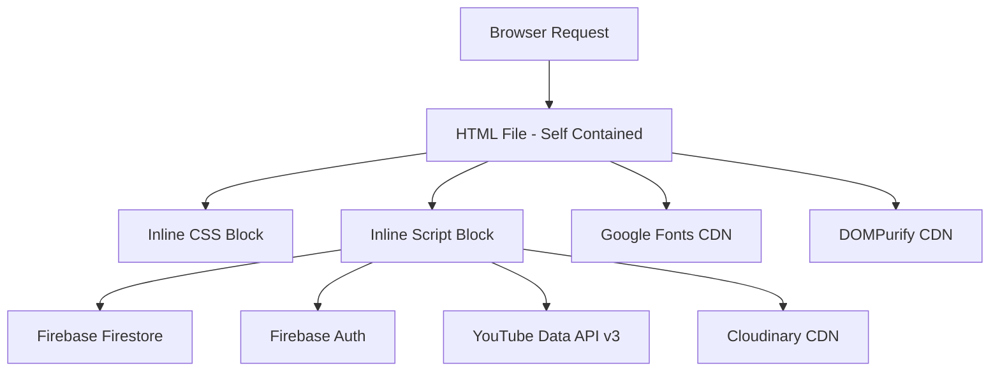
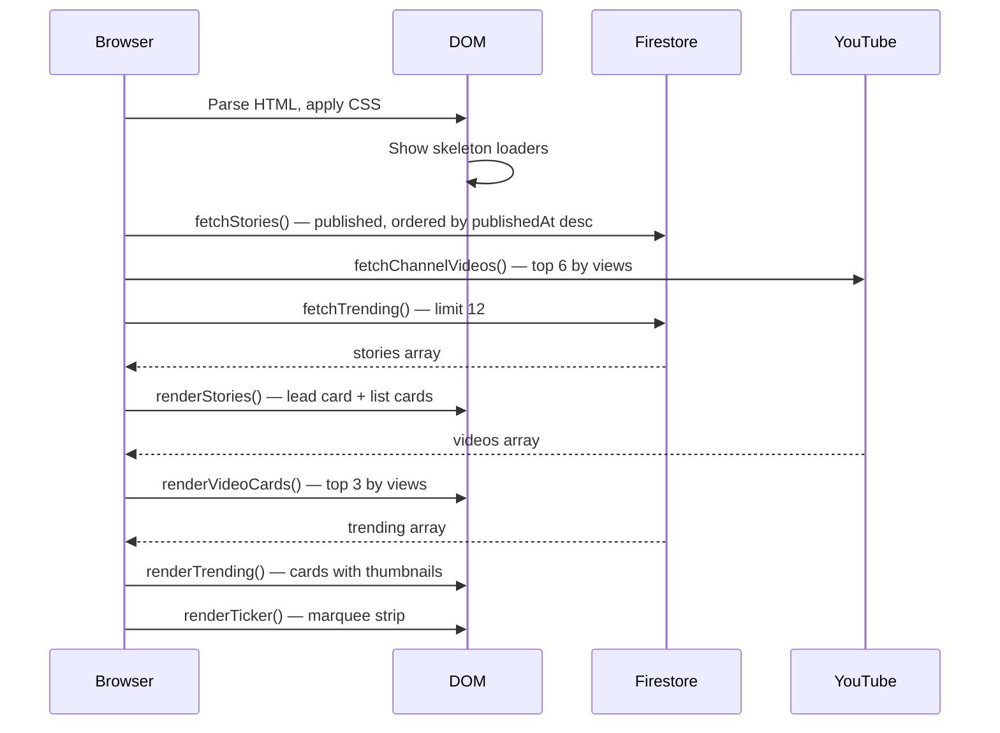
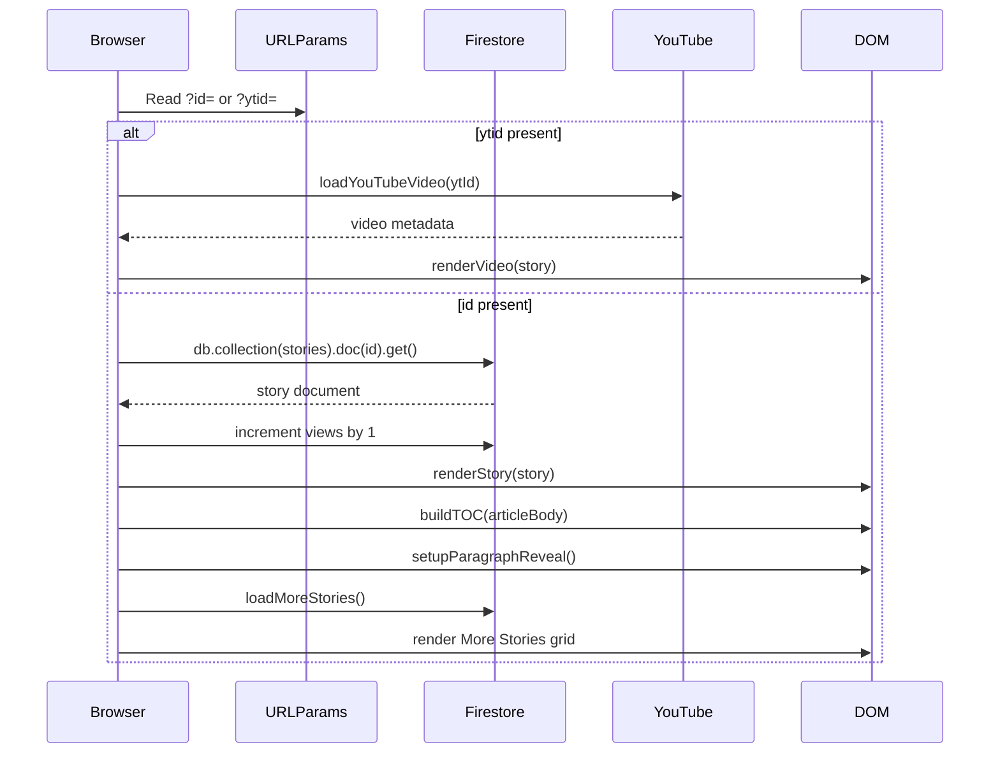
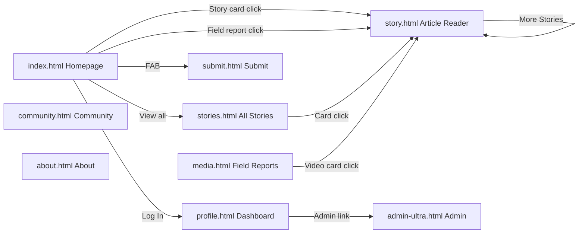
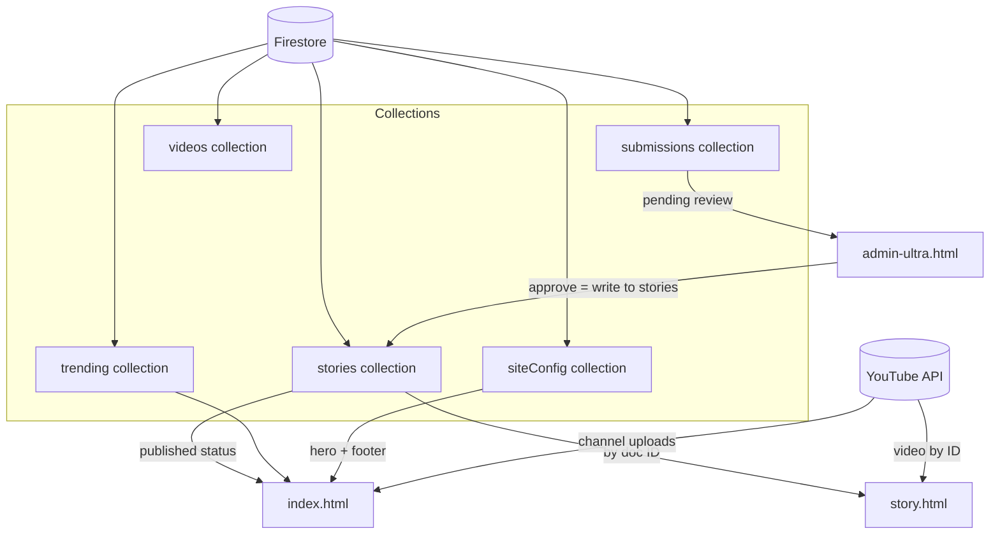

# Project Architecture

> WEVOX — Complete system architecture, rendering pipeline, and design philosophy.

Related: [SYSTEM_WORKFLOW.md](SYSTEM_WORKFLOW.md) | [FIREBASE.md](FIREBASE.md) | [UI_DESIGN_SYSTEM.md](UI_DESIGN_SYSTEM.md)

---

## Table of Contents

- [Overall Architecture](#overall-architecture)
- [File Responsibilities](#file-responsibilities)
- [JavaScript Architecture](#javascript-architecture)
- [CSS Architecture](#css-architecture)
- [Rendering Lifecycle](#rendering-lifecycle)
- [Event Flow](#event-flow)
- [Navigation Flow](#navigation-flow)
- [Component Hierarchy](#component-hierarchy)
- [Data Flow](#data-flow)
- [Design Philosophy](#design-philosophy)

---

## Overall Architecture

WEVOX is a **zero-build, serverless, document-centric SPA-like architecture**.

There is no:
- Backend server
- Build pipeline (no Webpack, Vite, Parcel)
- Frontend framework (no React, Vue, Angular)
- CSS preprocessor (no Sass, Less)
- Package manager dependency at runtime

Every page is a **self-contained HTML file** that:
1. Declares its own CSS inline in `<style>`
2. Loads Firebase SDK from Google CDN
3. Runs all logic in an inline `<script>` block
4. Fetches data from Firestore at runtime
5. Renders content into the DOM dynamically



---

## File Responsibilities

| File | Role | Auth Required | Data Source |
|---|---|---|---|
| `index.html` | Homepage — editorial feed, trending, field reports | No | Firestore + YouTube API |
| `story.html` | Dynamic article/video reader | No | Firestore (by `?id=`) or YouTube (by `?ytid=`) |
| `stories.html` | Full story listing with search and category filter | No | Firestore |
| `media.html` | Field Reports video grid | No | YouTube Data API v3 |
| `submit.html` | Story and video submission form | Yes (Firebase Auth) | Writes to Firestore |
| `admin-ultra.html` | Admin dashboard — approve, edit, publish | Yes (Firebase Auth, admin email check) | Reads/writes Firestore |
| `profile.html` | User journalist dashboard | Yes (Firebase Auth) | Reads Firestore by UID |
| `community.html` | Community leaderboard and contributor list | No | Reads Firestore |
| `about.html` | Static about page | No | Static HTML |
| `join.html` | Onboarding / join page | No | Static + Auth |
| `admin.html` | **Retired legacy admin. Do not use.** | — | — |
| `news.html` | *Needs Verification — purpose unclear* | — | — |

---

## JavaScript Architecture

Each HTML file contains a single `<script>` block at the bottom of `<body>`. There are no external `.js` files.

### Pattern used in every page

```
1. Firebase config + initialisation
2. State variables (allStories, currentCategory, etc.)
3. Demo/fallback data constants (SAMPLE_STORIES, etc.)
4. DOM helper functions ($ shorthand, escapeHtml, formatDate)
5. UI event listeners (navbar scroll, hamburger, FAB)
6. Data fetchers (fetchStories, fetchVideos, fetchTrending)
7. Render functions (renderStories, renderVideoCards, renderTrending)
8. Kick-off calls (loadStory(), fetchStories(), etc.)
```

### Key architectural decisions

**Why inline scripts?**
No build step means no module bundling. Inline scripts avoid CORS issues with `file://` protocol and keep each page independently deployable.

**Why demo fallback data?**
Every page that reads Firestore has hardcoded `SAMPLE_*` constants. If Firestore is unreachable (network error, quota exceeded, missing index), the page renders with demo content instead of showing an error. This is a deliberate resilience decision.

**Why `escapeHtml()` AND DOMPurify?**
- `escapeHtml()` is used for simple string interpolation into HTML attributes and text nodes (author names, categories, titles)
- `DOMPurify` is used for rich HTML content from Firestore (article body) which may contain `<p>`, `<h2>`, `<blockquote>`, `<iframe>` etc.
These are complementary, not redundant.

---

## CSS Architecture

All CSS is written inline in a `<style>` block in each HTML file's `<head>`.

### Structure within each `<style>` block

```
1. Design Tokens (:root CSS custom properties)
2. Reset (box-sizing, margin, padding)
3. Base elements (body, a, button, img, ul)
4. Layout utilities (.container)
5. Component styles (navbar, hero, cards, etc.)
6. Animation keyframes
7. Responsive overrides (@media max-width: 1024px)
8. Responsive overrides (@media max-width: 768px)
9. Responsive overrides (@media max-width: 480px)
```

### Design token system

All colours, fonts, and spacing are defined as CSS custom properties on `:root`. Every component references these tokens. This means the entire visual identity can be changed by editing the `:root` block.

```css
:root {
  --bg: #F9F7F4;           /* Warm off-white page background */
  --bg-dark: #0D0D0D;      /* Near-black for footer, overlays */
  --surface: #FFFFFF;      /* Card backgrounds */
  --border: #E8E4DF;       /* Subtle warm grey borders */
  --text-primary: #1A1A1A; /* Near-black body text */
  --text-secondary: #6B6B6B;
  --text-muted: #9A9A9A;
  --accent: #C8102E;       /* WEVOX red — the brand colour */
  --accent-hover: #A50D26;
  --tag-bg: #F0EDE8;       /* Warm tint for tag backgrounds */
  --font-headline: "Literata", Georgia, serif;
  --font-body: "DM Sans", system-ui, sans-serif;
  --font-mono: "IBM Plex Mono", monospace;
  --max-width: 1240px;
  --gutter: 32px;          /* Reduced to 20px on mobile */
}
```

### Why CSS is duplicated across files

Because there is no shared stylesheet, the design token block and base reset are copied verbatim into every HTML file. This is a known trade-off: it increases file size but eliminates the need for a build step and keeps each page independently deployable. See [KNOWN_ISSUES.md](KNOWN_ISSUES.md).

---

## Rendering Lifecycle

### Homepage (`index.html`)



### Story page (`story.html`)



---

## Event Flow

### Global events present on every page

| Event | Trigger | Handler |
|---|---|---|
| `scroll` | Window scroll | Navbar shadow toggle, reading progress bar update, TOC active state |
| `click` on `.hamburger` | Mobile menu open | `openMenu()` — shows mobile overlay |
| `click` on `.close` / overlay links | Mobile menu close | `closeMenu()` |
| `click` on `.fab` | FAB toggle | Expand/collapse submit options |
| `click` outside `.fab-wrap` | FAB close | Collapse FAB |
| `keydown` Escape | Modal/overlay close | Close video modal or mobile overlay |

### Homepage-specific events

| Event | Trigger | Handler |
|---|---|---|
| `click` on `.chip` | Category filter | `renderStories()` + `renderVideos()` with filter |
| `click` on `.video-card` | Field report card | Navigate to `story.html?ytid=` |
| `click` on `.story-card` | Story card | Navigate to `story.html?id=` |

### Story page-specific events

| Event | Trigger | Handler |
|---|---|---|
| `scroll` | Reading progress | `updateProgress()` + `updateActiveTOC()` |
| `click` on TOC link | Section jump | Smooth scroll to heading |
| `click` on share buttons | Share | Twitter/X intent, WhatsApp, clipboard copy |
| `IntersectionObserver` | Paragraph enters viewport | Fade-in reveal animation |

---

## Navigation Flow



---

## Component Hierarchy

```
Page
├── <header class="navbar">
│   ├── .logo
│   ├── <nav class="nav-links">
│   └── .btn-submit / .hamburger
├── .mobile-overlay
├── [Page-specific content]
│   ├── .identity (homepage hero)
│   ├── .ticker
│   ├── .filter-bar
│   ├── .main-grid
│   │   ├── #stories (.stories-list)
│   │   │   ├── .story-card.lead (first story)
│   │   │   └── .story-card (subsequent stories)
│   │   └── #videos (.videos-list)
│   │       └── .video-card
│   │           ├── .video-thumb-wrap
│   │           └── .video-body
│   │               ├── .video-tag
│   │               ├── .video-title
│   │               └── .video-meta
│   └── .trending
│       └── .trending-row
│           └── .trending-card
│               ├── .trending-thumb-wrap
│               │   ├── .trending-thumb
│               │   └── .trending-num (rank badge)
│               └── .trending-body
│                   ├── .trending-tag
│                   ├── .trending-title
│                   └── .trending-count
├── .fab-wrap
└── <footer>
    ├── .footer-grid
    └── .footer-bottom
```

---

## Data Flow



---

## Design Philosophy

### Why no framework?

WEVOX is a content-first platform. The primary performance concern is **time to first meaningful content** — the headline and cover image. A framework adds JavaScript parse time before any content renders. Vanilla JS with inline scripts renders the skeleton immediately and hydrates content as data arrives.

### Why self-contained HTML files?

Each page can be opened directly from the filesystem, deployed to any static host, or shared as a single file. There are no import dependencies to break.

### Why inline CSS?

Eliminating a separate CSS request removes one render-blocking resource. The CSS is small enough that inlining it is a net performance win.

### Why DOMPurify for article bodies only?

Article bodies are the only place where arbitrary HTML from Firestore is injected into the DOM. All other dynamic content (titles, author names, categories) is escaped with `escapeHtml()` before interpolation. DOMPurify is loaded only on `story.html` where it is needed.

### Editorial hierarchy principle

Every layout decision follows a single rule: **the most important story gets the most space**. The lead story on the homepage is a full-width hero. Subsequent stories are compact list cards. The sidebar (Field Reports) is visually subordinate to the main column. Trending cards are the smallest unit. This mirrors the front page hierarchy of a print newspaper.
