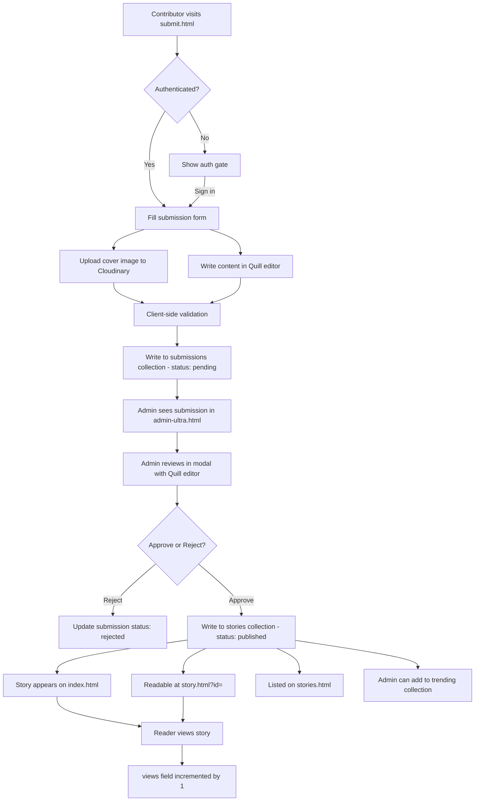

# Story Pipeline

> WEVOX — Complete article lifecycle from submission to reader.

Related: [FIREBASE.md](FIREBASE.md) | [SYSTEM_WORKFLOW.md](SYSTEM_WORKFLOW.md) | [CLOUDINARY.md](CLOUDINARY.md)

---

## Complete Pipeline



---

## Stage 1: Submission

**Page:** `submit.html`
**Auth required:** Yes

### What the contributor provides

| Field | Input method | Stored as |
|---|---|---|
| Title | Text input | `title` string |
| Category | Dropdown select | `category` string |
| Excerpt / standfirst | Textarea | `excerpt` string |
| Article body | Quill rich-text editor | `content` HTML string |
| Cover image | File upload → Cloudinary | `coverImage` URL string |
| Read time | Auto-calculated or manual | `readTime` string |

### What is written to Firestore

```javascript
{
  title, category, excerpt, content,
  coverImage,  // Cloudinary URL
  readTime,
  author,      // from Firebase Auth display name
  authorUid,   // Firebase Auth UID
  authorEmail, // Firebase Auth email
  university,  // from user profile
  submittedAt: firebase.firestore.FieldValue.serverTimestamp(),
  status: 'pending'
}
```

---

## Stage 2: Admin Review

**Page:** `admin-ultra.html`
**Auth required:** Yes

1. Admin navigates to the Submissions section
2. Pending submissions are fetched from Firestore (`where status == pending`)
3. Admin clicks Review — opens a modal with the full submission
4. Admin can edit the content in an embedded Quill editor
5. Admin can approve or reject

### On Approve

```javascript
// Write to stories collection
db.collection('stories').add({
  ...submissionData,
  status: 'published',
  publishedAt: firebase.firestore.FieldValue.serverTimestamp()
});

// Update submission status
db.collection('submissions').doc(submissionId).update({
  status: 'approved'
});
```

### On Reject

```javascript
db.collection('submissions').doc(submissionId).update({
  status: 'rejected'
});
```

---

## Stage 3: Publication

Once a story document exists in the `stories` collection with `status: 'published'`, it becomes visible on:

| Surface | How it appears | Query used |
|---|---|---|
| `index.html` homepage | Story card (lead or list) | `where status == published, orderBy publishedAt desc, limit 40` |
| `stories.html` listing | Story card in grid | Same query |
| `story.html` | Full article reader | `doc(storyId)` |
| Trending section | If admin adds to `trending` collection | Manual curation |

---

## Stage 4: Reading

**Page:** `story.html?id={storyId}`

1. URL parameter `id` is read from `window.location.search`
2. Firestore document is fetched by ID
3. `status` is checked — if not `published`, show "under review" state
4. `renderStory(story)` is called:
   - Article body HTML is sanitised by DOMPurify
   - Table of contents is auto-generated from `<h2>` and `<h3>` tags
   - Paragraphs are set up for IntersectionObserver reveal
   - Share buttons are built
   - Author card is rendered
5. `views` field is incremented by 1 (fire and forget, errors ignored)
6. `loadMoreStories()` fetches 3 related stories from the same category

---

## Stage 5: Discovery

Readers discover stories through:

| Discovery path | Mechanism |
|---|---|
| Homepage lead card | First published story by date |
| Homepage story list | Next 3 published stories |
| Category filter | Client-side filter on loaded stories |
| Trending section | Admin-curated `trending` collection |
| Live ticker | Trending item titles in marquee |
| More Stories (story page) | Same-category stories |
| Related story (sidebar) | First item from More Stories |
| Direct URL share | `story.html?id={storyId}` |

---

## Content Sanitisation in the Pipeline

| Stage | Input | Sanitisation |
|---|---|---|
| Submission form | Quill HTML output | Client-side: Quill's own sanitisation |
| Admin review | Quill HTML output | Client-side: Quill's own sanitisation |
| Story render | Firestore HTML string | DOMPurify 3.1.6 with strict allowlist |
| All metadata fields | Firestore strings | `escapeHtml()` on interpolation |

The DOMPurify sanitisation happens at **render time**, not at write time. This means even if malicious HTML is written to Firestore, it is stripped before it reaches the DOM.
