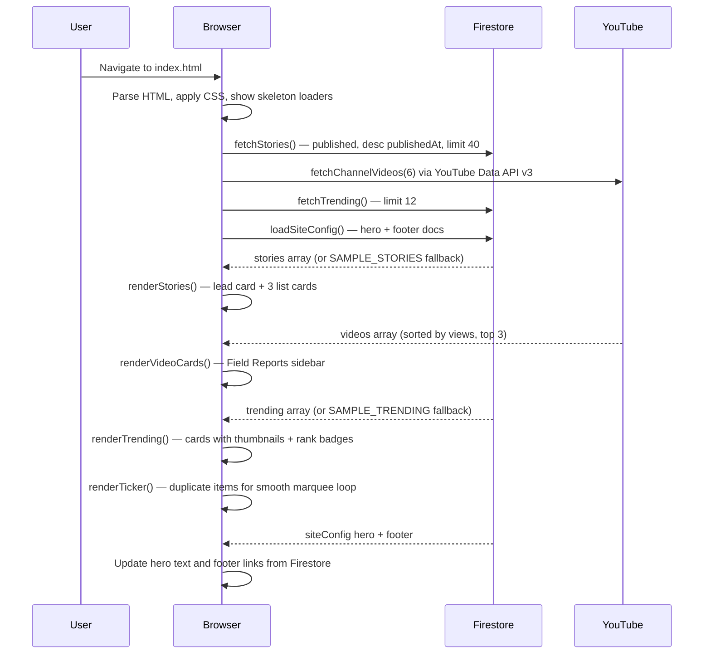
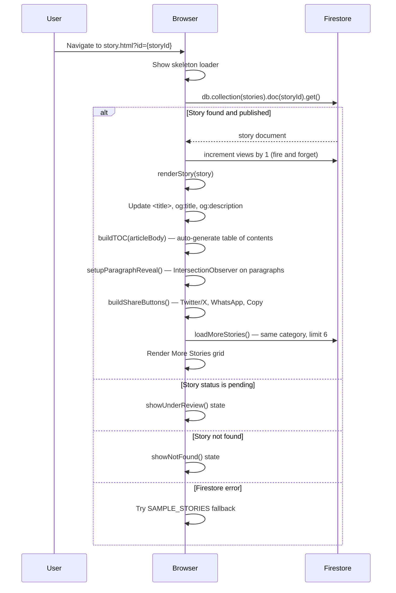
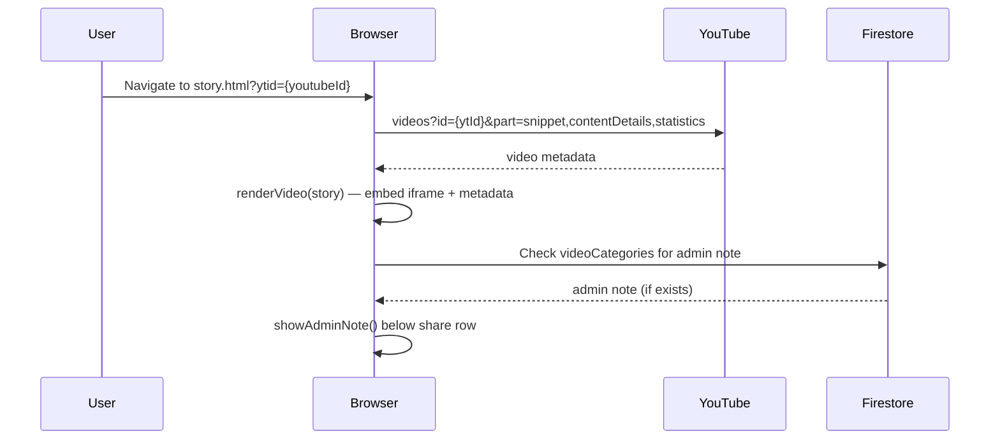
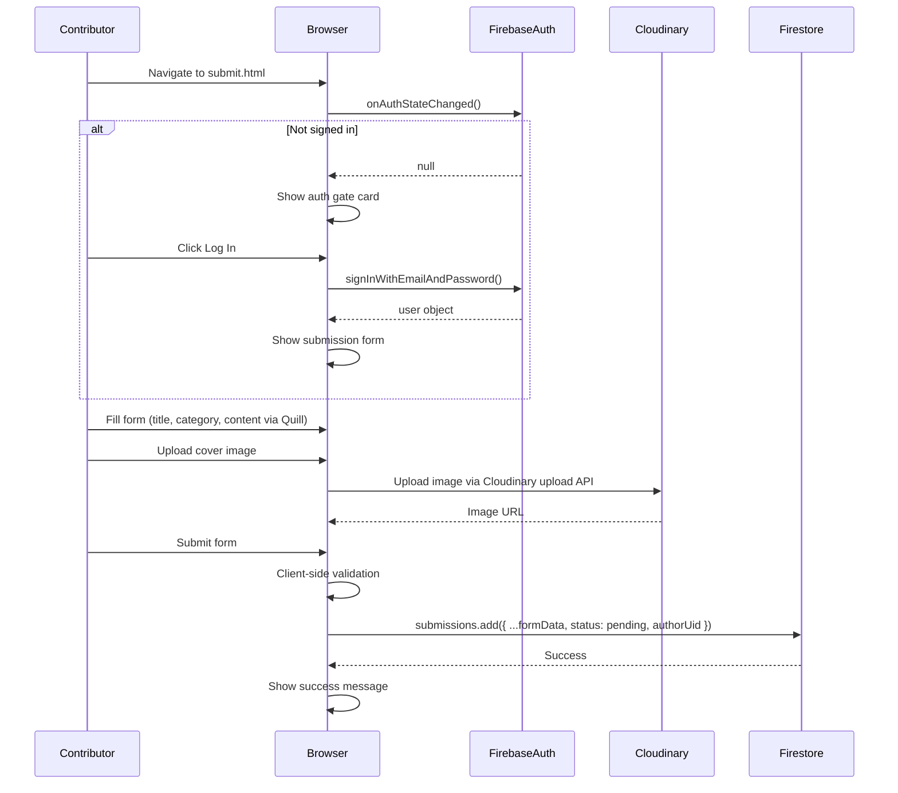
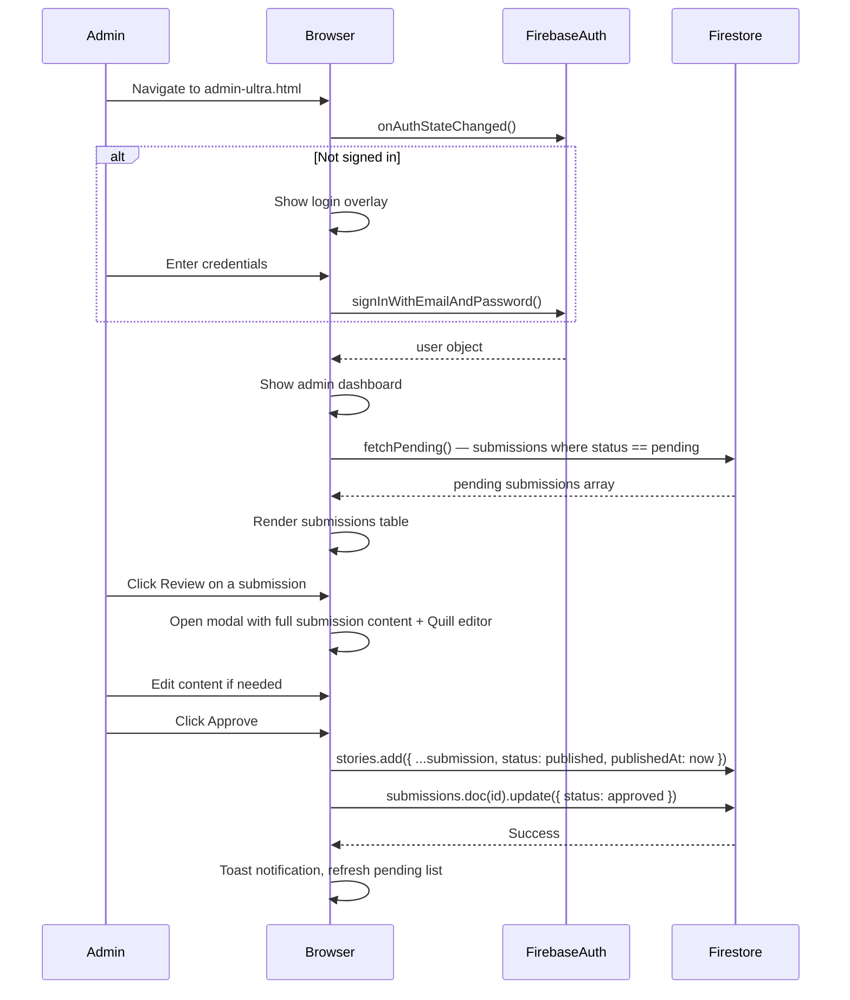
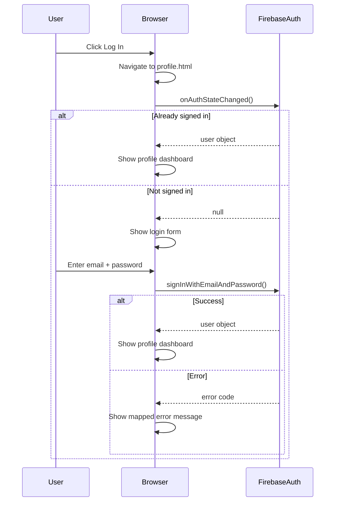

# System Workflow

> WEVOX — Every user and admin workflow, step by step.

Related: [STORY_PIPELINE.md](STORY_PIPELINE.md) | [FIREBASE.md](FIREBASE.md) | [PROJECT_ARCHITECTURE.md](PROJECT_ARCHITECTURE.md)

---

## Workflows

- [Homepage Rendering](#homepage-rendering)
- [Story Reading](#story-reading)
- [Field Report Viewing](#field-report-viewing)
- [Story Submission](#story-submission)
- [Admin: Review and Publish](#admin-review-and-publish)
- [Authentication](#authentication)
- [Category Filtering](#category-filtering)
- [Trending Section](#trending-section)
- [Profile Dashboard](#profile-dashboard)
- [Community Leaderboard](#community-leaderboard)
- [Media / Field Reports Page](#media--field-reports-page)

---

## Homepage Rendering

**Fallback behaviour:** If any Firestore call fails, the page renders with `SAMPLE_*` demo data. The user never sees an error state on the homepage.

---

## Story Reading

---

## Field Report Viewing

---

## Story Submission

---

## Admin: Review and Publish

---

## Authentication

---

## Category Filtering

1. User clicks a category chip (e.g., "Campus Fraud")
2. All chips lose `.active` class; clicked chip gains `.active`
3. `currentCategory` state variable is updated
4. `renderStories()` is called — filters `allStories` array client-side by `matchesCategory()`
5. `renderVideos()` is called — filters `allVideos` array client-side
6. No new Firestore request is made — filtering is entirely client-side on already-loaded data

---

## Trending Section

1. `fetchTrending()` reads the `trending` Firestore collection (limit 12)
2. `renderTicker()` duplicates the items array and renders a marquee strip
3. `renderTrending()` renders cards with:
   - Thumbnail resolved via `resolveTrendingThumb()`: `t.imageUrl` → `allStories` lookup by `ref_id` → picsum fallback
   - Rank badge overlaid on thumbnail (bottom-left)
   - Category tag, headline, read count in `.trending-body`
4. Cards are horizontally scrollable with `scroll-snap-type: x mandatory`

---

## Profile Dashboard

1. `onAuthStateChanged()` checks auth state
2. If signed in: reads user's stories from Firestore by `authorUid`
3. Displays: story count, total views, submitted stories list
4. If not signed in: shows login prompt

---

## Community Leaderboard

1. Reads contributor data from Firestore
2. Renders ranked list of contributors by story count or views
3. Public page — no auth required

---

## Media / Field Reports Page

1. `fetchChannelVideos()` calls YouTube Data API v3
2. Fetches channel uploads playlist
3. Fetches video metadata (title, thumbnail, duration, views, publishedAt)
4. Renders video grid with category filter
5. Click on video card navigates to `story.html?ytid={youtubeId}`
